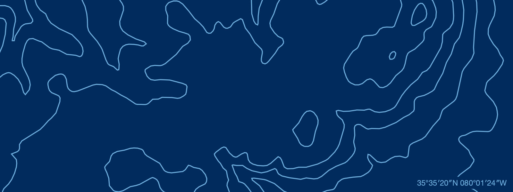
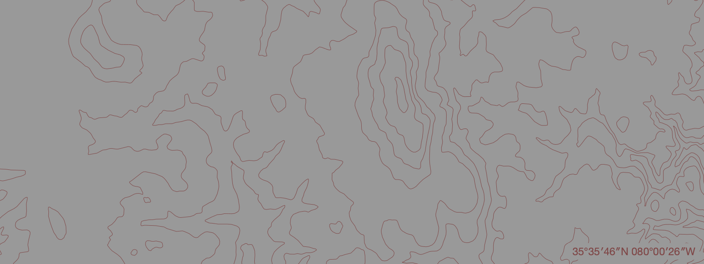

# FS Topo

The National Forest Service publishes a variety of maps covering National Forests and National Parks within the United States. I love the topographic maps and, for now good reason, I wrote this thing to try to extract the contour lines from the maps so they could easily be rendered via cairo.

## Examples




## Pre-requisites

## Using this project

### 1. Download a map

You're going to need a map. I have no idea if this will work with all of the Forest Service's maps. I seriously doubt it. However, this will work for the Uwharrie National Forest maps located on [this page](https://www.fs.usda.gov/recarea/nfsnc/recarea/?recid=48934). I'm personally partial to the Northeastern portion that covers the Birkhead Mountains Wilderness [fseprd485939.pdf](https://www.fs.usda.gov/Internet/FSE_DOCUMENTS/fseprd485939.pdf).
Download the map:
```bash
curl \
	=A "Mozilla/5.0 (Macintosh; Intel Mac OS X 10_15_7) AppleWebKit/537.36 (KHTML, like Gecko) Chrome/125.0.0.0 Safari/537.36" \
	-O https://www.fs.usda.gov/Internet/FSE_DOCUMENTS/fseprd485939.pdf
```

### 2. Download the themes file.
The render command (used later) will pick color themes at random (or you can provide a seed). The themes that it picks from are stored in a binary format. You can download a themes file with,
```bash
curl -o themes.bin https://storage.googleapis.com/fs.kellegous.com/themes-small.bin
```

### 3. Convert the map to SVG

To do this I recommend using `pdftocairo` which is part of the `poppler` package. You can install that with homebrew using `brew install poppler`. Once you have that installed, you can convert the PDF to SVG:
```bash
pdftocairo -svg fseprd485939.pdf fseprd485939.svg
```

### 4. Build the project
```bash
cargo build --release
```

### 5. Extract the contour lines from the SVG
This command parses the SVG and finds paths that look like contours. It then extracts those paths into a JSON file. This command also requires a geographic region specified in a latitude and longitude bounding box (northwest corner - southeast corner).
```bash
target/release/topo extract \
	"35°38′47″N 080°03′00″W-35°29′20″N 079°51′00″W" \
	fseprd485939.svg \
	fseprd485939.json
```

### 5. Render the contour lines
```bash
target/release/topo render fseprd485939.json fseprd485939.png
```

## Author

[Kelly Norton](https://kellegous.com/)